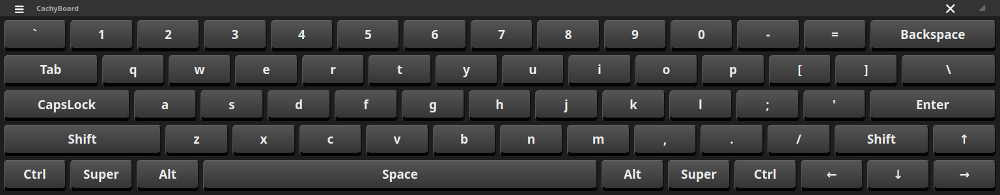
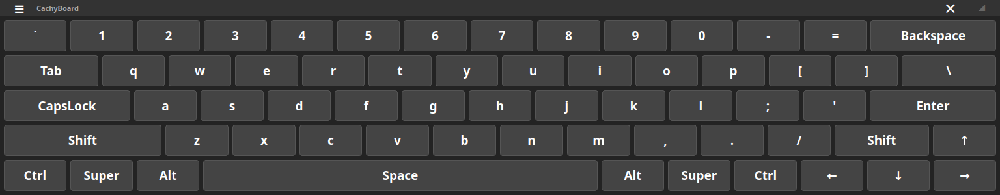
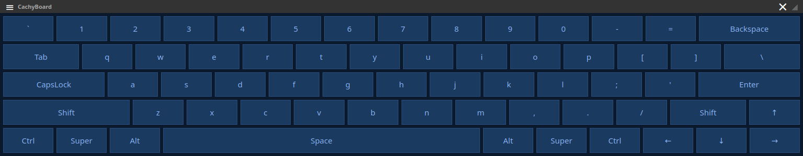
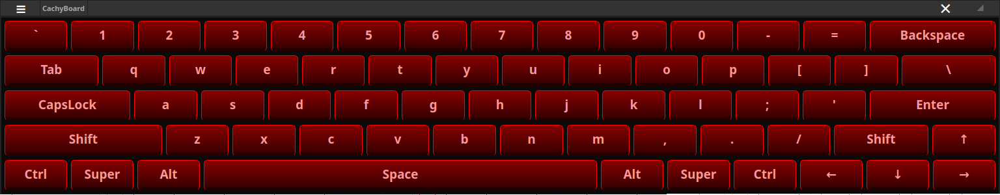
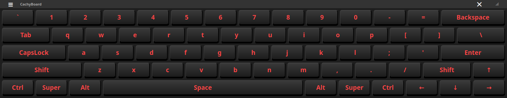

# CachyBoard

CachyBoard is a customizable on-screen virtual keyboard designed specifically for Wayland compositors (like KWin or wlroots). It is built with C++, Qt 6 and LayerShellQt.

## Features

*   **Hardware Sync**: Automatically synchronizes its Caps Lock state with your physical hardware keyboard.
*   **Customizable Themes**: Choose from multiple built-in CSS-based styles (Dark, 3D, Midnight Blue, Twilight, etc.).
*   **Audio Feedback**: Optional "click" sound effects on key presses.
*   **Wayland Native**: Uses `layer-shell` to stay on top of other windows without interfering with focus.
*   **Global Layout**: Supports standard QWERTY layout with shift modifiers and special keys.

## Styles






## Hardware Synchronization & uinput

CachyBoard uses the Linux `uinput` kernel module to create a virtual input device. This allows the application to send "real" keystrokes to the kernel, making it compatible with all applications, including those running with elevated privileges.

### Why udev rules are necessary
By default, `/dev/uinput` and the raw keyboard event devices in `/dev/input/` are restricted to the root user for security reasons. To allow CachyBoard to function as a standard user:
1.  **uinput Access**: The application needs permission to create a virtual keyboard device.
2.  **Hardware Sync**: To synchronize the Caps Lock LED state, the application reads from your physical keyboard. We use a udev rule to create a consistent symlink at `/dev/input/hw_kbd` that CachyBoard looks for.

### Setup Instructions

1.  **Add your user to the input group**:
    ```bash
    sudo usermod -aG input $USER
    ```

2.  **Create the udev rules file**:
    Create a file at `/etc/udev/rules.d/60-cachyboard.rules` with the following content:
    ```udev
    # Grant permissions for uinput
    KERNEL=="uinput", GROUP="input", MODE="0660", OPTIONS+="static_node=uinput"

    # Identify physical keyboards and create a symlink for hardware sync
    ACTION=="add|change", KERNEL=="event*", ENV{ID_INPUT_KEYBOARD}=="1", ATTRS{name}!="Qt Virtual Keyboard Device", SYMLINK+="input/hw_kbd", GROUP="input", MODE="0660"
    ```

3.  **Reload rules**:
    ```bash
    sudo udevadm control --reload-rules && sudo udevadm trigger
    ```

## Installation

You can install CachyBoard using the provided binary packages for your distribution.

### Checksums
Before installing, verify the integrity of the downloaded files:
```bash
sha256sum -c checksums.txt
```

### Debian / Ubuntu / KDE Neon (.deb)
```bash
sudo apt install ./CachyBoard-1.0.0-1-x86_64.deb
```

### Fedora / RHEL / OpenSUSE (.rpm)
```bash
sudo dnf install ./CachyBoard-1.0.0-1-x86_64.rpm
```

### Arch Linux (.pkg.tar.zst)
```bash
sudo pacman -U cachyboard-1.0.0-1-x86_64.pkg.tar.zst
```

## Building from Source

### Dependencies
Ensure you have the following installed (package names may vary by distro):
*   Qt 6 (Base, Multimedia, Wayland)
*   LayerShellQt
*   libxkbcommon
*   CMake & Extra-CMake-Modules

**Arch Linux Example:**
```bash
sudo pacman -S --needed base-devel cmake qt6-base qt6-wayland qt6-multimedia layer-shell-qt libxkbcommon
```

### Build Steps
1.  **Clone the repository**:
    ```bash
    git clone https://github.com/silo0074/CachyBoard.git
    cd CachyBoard
    ```
2.  **Configure and Build**:
    ```bash
    mkdir build && cd build
    cmake ..
    make
    ```
3.  **Install**:
    ```bash
    sudo make install
    ```

## Usage
Launch the application from your app launcher or by running `CachyBoard` in the terminal. Use the "≡" icon to access settings, change themes, or toggle sound effects.

## Compatibility
CachyBoard is designed for **Wayland** compositors that support the Layer Shell protocol:
* **KDE Plasma** (KWin)
* **Hyprland**
* **Sway**
* **GNOME** (requires the `aylur/gnome-shell-extension-layer-shell` extension)

*Note: X11 is not currently supported.*

## Credits
Typing sounds were obtained from these sources:
* Default Click: [click.wav](https://github.com/onboard-osk/onboard/tree/main/sounds)
* Right Click: [irinairinafomicheva-rclick-13693.wav](https://pixabay.com/users/irinairinafomicheva-25140203)
* Touchpad Click: [lesiakower-laptop-touchpad-click-384384.wav](https://pixabay.com/users/lesiakower-25701529)
* Typewriter: [matthewvakaliuk73627-mouse-click-290204.wav](https://pixabay.com/users/matthewvakaliuk73627-48347364)
* Select Sound: [u_2fbuaev0zn-select-sound-121244.wav](https://pixabay.com/users/u_2fbuaev0zn-30247713)

## License
This project is licensed under the [GPLv3](https://github.com/silo0074/CachyBoard/blob/main/LICENSE) License.
